# Cyber Security Learning Demo — Brute Force Attack with Burp Suite

> [!CAUTION]
> **Security Note — Educational Purposes Only**
> Brute-forcing and credential stuffing attacks are illegal when performed against systems you do not own or have explicit authorization to test. This project and its tools are strictly for educational purposes to demonstrate how these attacks function and how to defend against them effectively.

---

## Project Overview

This project demonstrates how a brute force / credential stuffing attack works against a simple Flask login application, using Burp Suite's Intruder tool to intercept and replay login requests with a wordlist.

---

## Prerequisites

- Python 3.x installed
- Burp Suite Community Edition ([portswigger.net](https://portswigger.net/burp/communitydownload))
- Google Chrome with the **FoxyProxy** extension installed
- The Flask login app running locally

---

## Step 1 — Run the Flask App

```bash
python setup_db.py   # creates and seeds the SQLite database
python app.py        # starts the Flask server
```

Visit `http://localhost:5000` to confirm the app is running. You should see the **Cyber Learning Demo - Home** landing page.

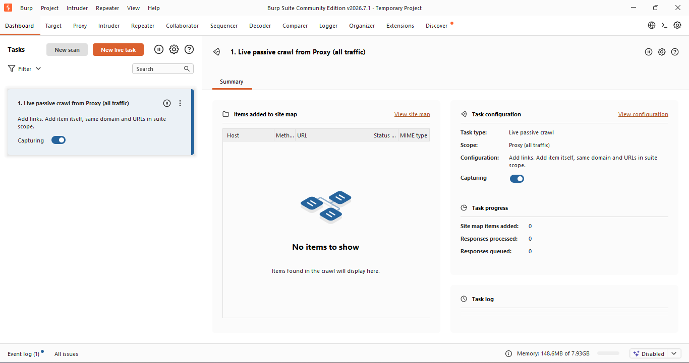

---

## Step 2 — Configure FoxyProxy in Chrome

1. Click the **FoxyProxy** extension icon in Chrome toolbar
2. Go to **Options → Proxies → Add**
3. Fill in the following fields:

| Field | Value |
|---|---|
| Title | `Burp Suite` |
| Type | `HTTP` |
| Hostname | `127.0.0.1` |
| Port | `8080` |
| Username | *(leave blank)* |
| Password | *(leave blank)* |

4. Click the orange **Save** button
5. Click the FoxyProxy icon again → click **Burp Suite** to activate it

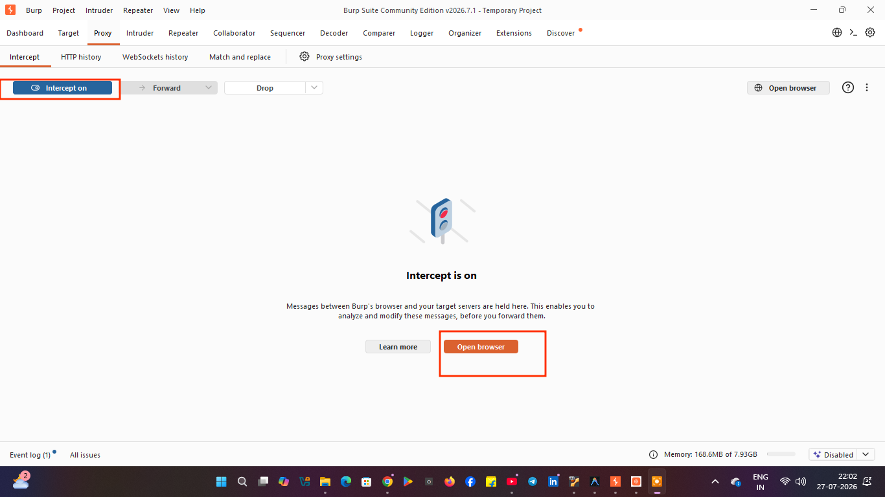

---

## Step 3 — Configure Burp Suite Proxy

1. Open **Burp Suite** → start a **Temporary Project** with default settings
2. Go to **Proxy** tab → **Proxy Settings**
3. Confirm the listener is set to `127.0.0.1:8080` and is **Running**
4. Go to **Proxy → Intercept** tab
5. Click **"Intercept is on"** to enable interception

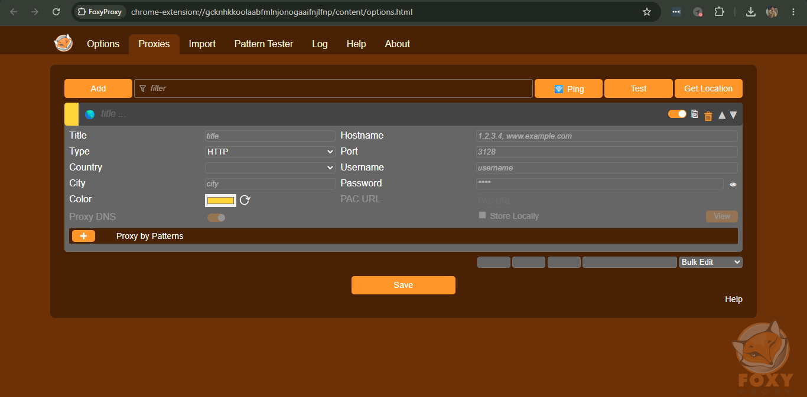
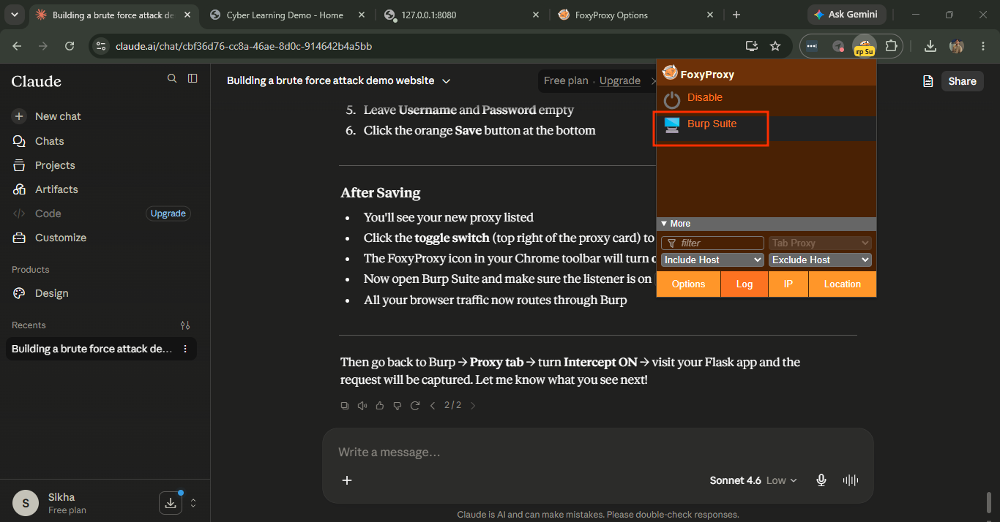

---

## Step 4 — Intercept the Login Request

1. In Chrome (with FoxyProxy pointing to Burp), visit `http://localhost:5000/login`
2. Keep clicking **Forward** in Burp for any GET requests until the login page loads
3. Enter any credentials on the login form (e.g. username: `alice`, password: `password123`)
4. Click the **Login** button
5. Burp will intercept the **POST request** — it will look like this:

```
POST /login HTTP/1.1
Host: localhost:5000
Content-Type: application/x-www-form-urlencoded

username=alice&password=password123
```

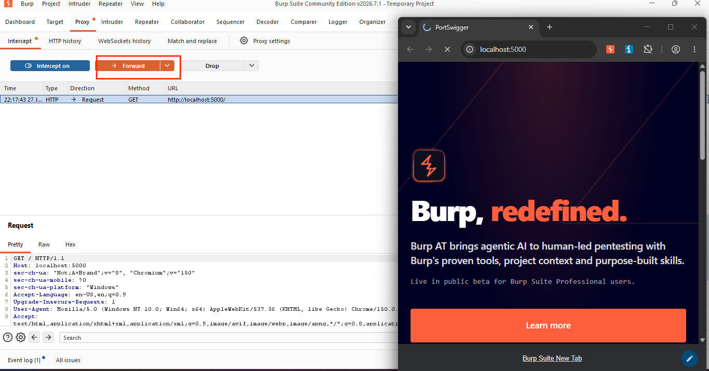
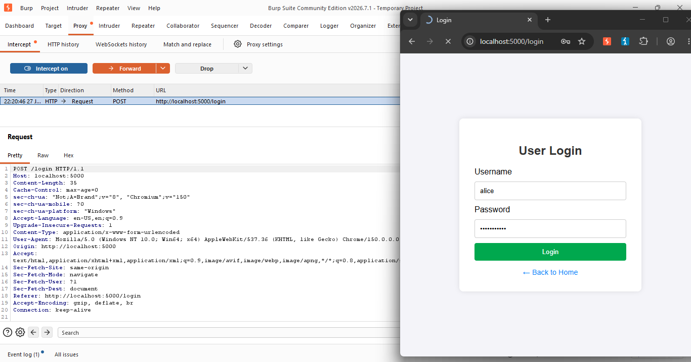

---

## Step 5 — Send to Intruder

1. Right-click anywhere on the captured request in Burp
2. Select **"Send to Intruder"**
3. Go to the **Intruder** tab

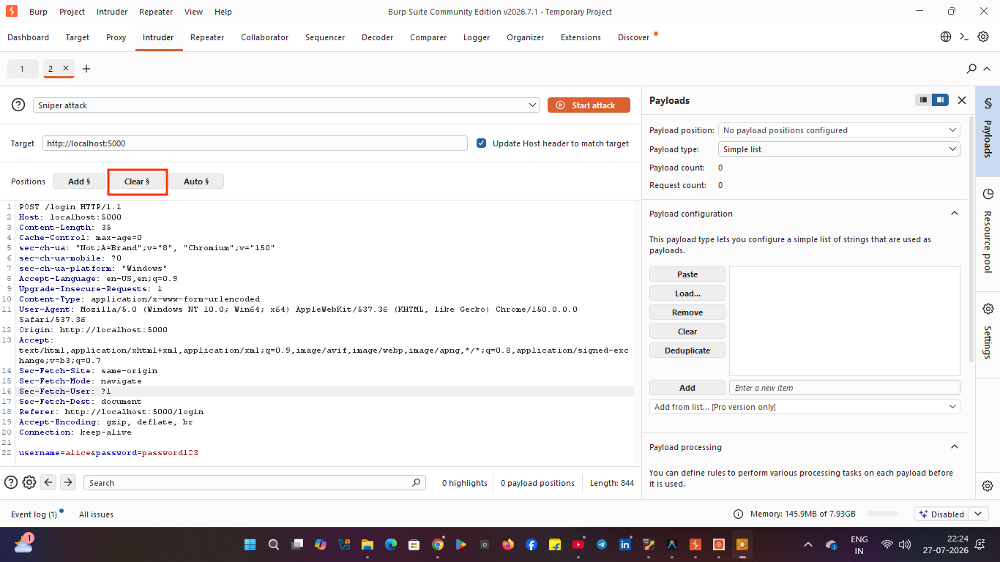

---

## Step 6 — Configure Positions

1. Click the **Positions** subtab
2. Click **"Clear §"** to remove all existing markers
3. Click **"Auto §"** — Burp will auto-detect the form fields
4. Line 22 should now show:
```
username=§alice§&password=§password123§
```
5. Confirm the bottom bar shows **"2 payload positions"**
6. Set the **Attack Type** dropdown to **"Pitchfork attack"**

> **Note:** If you see `§§alice§§` (4 markers), you have too many positions. Click Clear § and use Auto § again.

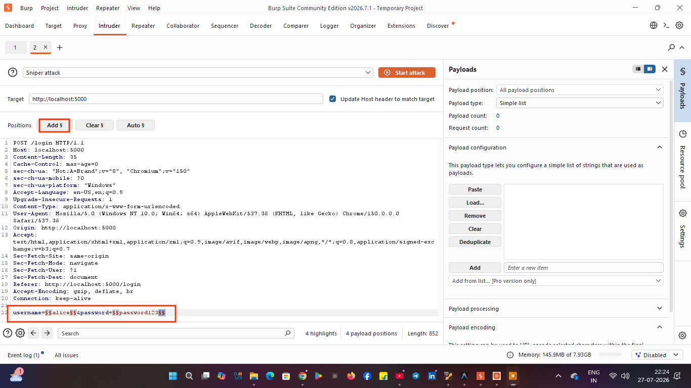

---

## Step 7 — Load Wordlists (Payloads)

1. Click the **Payloads** subtab
2. In the **Payload position** dropdown, select **1**
3. Click **Load...** → select `usernames.txt`
4. In the **Payload position** dropdown, select **2**
5. Click **Load...** → select `passwords.txt`
6. Confirm **Payload count: 50** for each

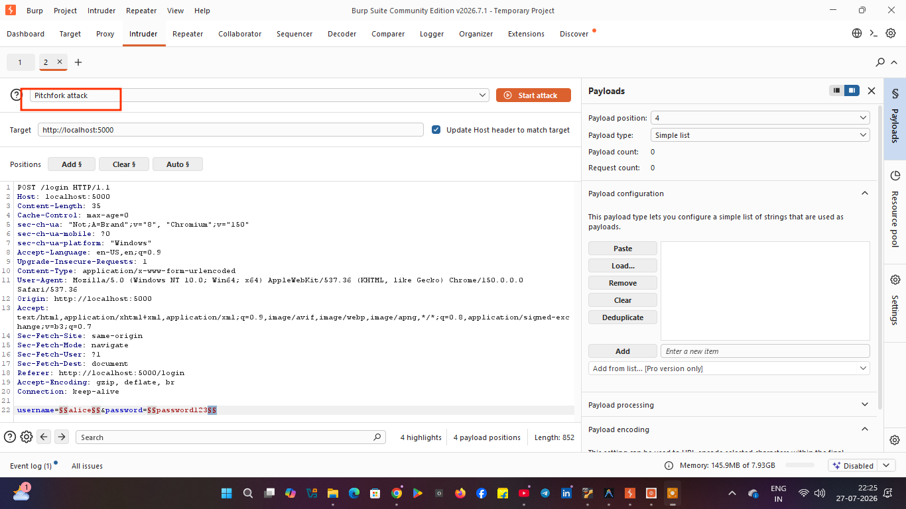
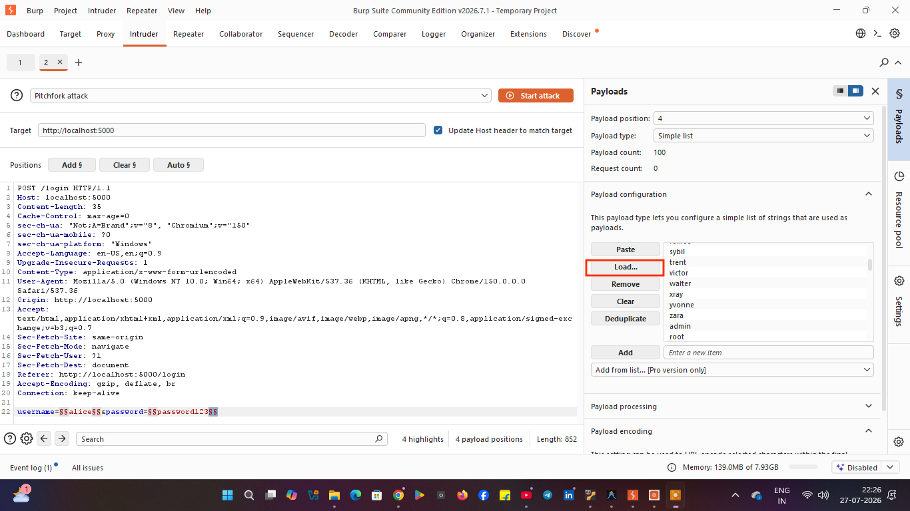
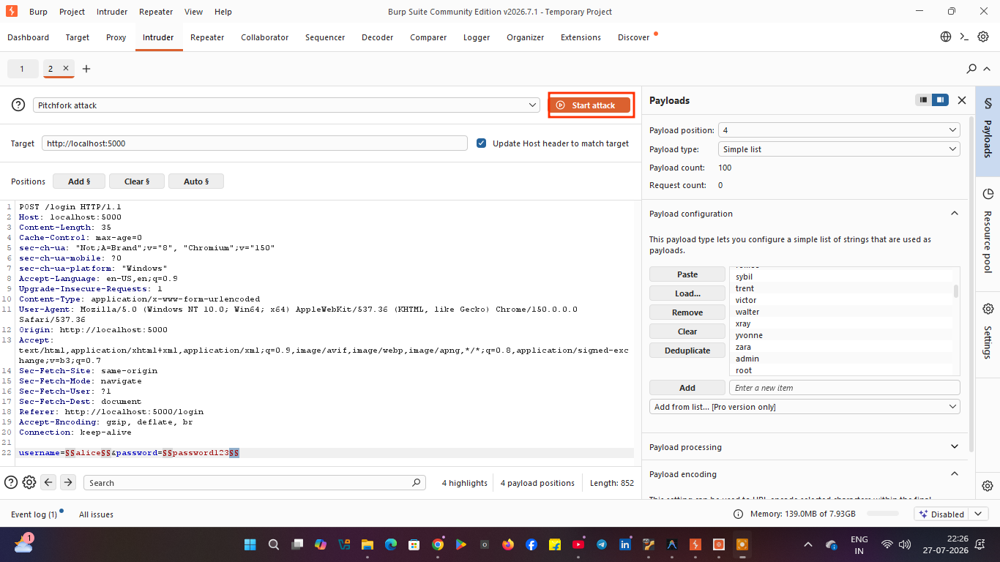

---

## Step 8 — Start the Attack

1. Click **"Start attack"** (top right orange button)
2. A new results window opens titled **"Intruder attack of http://localhost:5000"**
3. Watch the requests fire — the attack runs through all username/password pairs

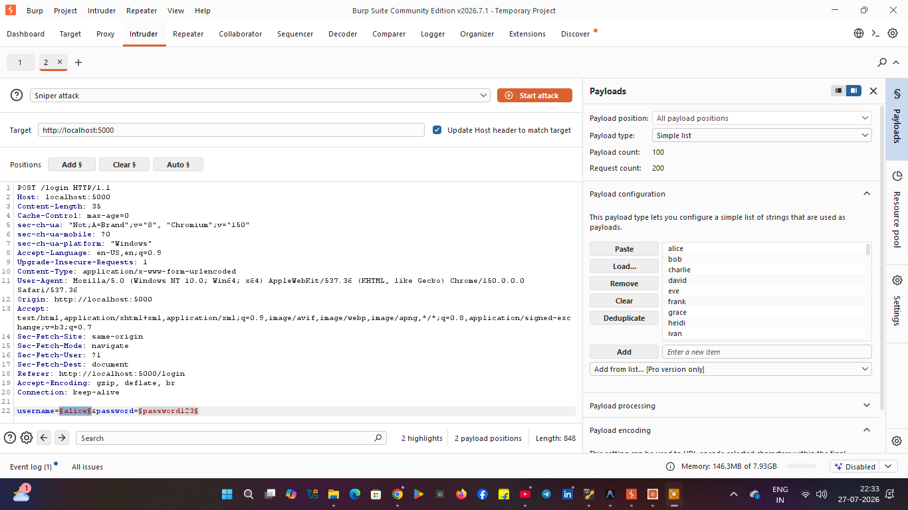

---

## Step 9 — Identify Valid Credentials

Sort the results by the **Status code** or **Length** column:

| Status Code | Length | Meaning |
|---|---|---|
| **302** | **522** | ✅ Login SUCCESS — valid credential found |
| **200** | **2002** | ❌ Login FAILED — wrong credentials |

In the example results:

- **Request 0** (original) → `302` → ✅ Success
- **Request 1** (`alice`) → `302` → ✅ **Valid credential found!**
- **Request 2** (`bob`) → `200` → ❌ Failed
- **Request 3** (`charlie`) → `200` → ❌ Failed

Any row with **Status 302 and Length 522** is a valid username/password pair.

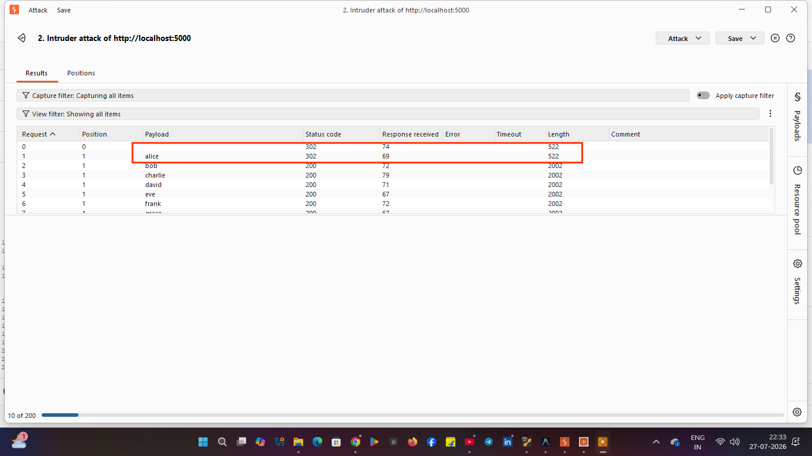

---

## Understanding the Attack Types

| Attack Type | How it Works | Use Case |
|---|---|---|
| **Sniper** | One list, cycles through one position at a time | Testing usernames only |
| **Pitchfork** | Two lists paired (user1+pass1, user2+pass2) | Credential stuffing |
| **Cluster Bomb** | Every combination of both lists | Full brute force |

---

## Project File Structure

```
project/
├── app.py              # Flask web application
├── setup_db.py         # Database setup and seeding script
├── audit.py            # Security audit / credential test script
├── usernames.txt       # 50 usernames (one per line)
├── passwords.txt       # 50 passwords (one per line, matching order)
├── users.db            # SQLite database (auto-generated)
└── templates/
    ├── index.html      # Landing page
    ├── login.html      # Login form
    └── dashboard.html  # Post-login dashboard
```

---

## How to Defend Against This Attack

Once you have demonstrated the vulnerability, add these defenses to `app.py`:

- **Rate limiting** — use `Flask-Limiter` to allow max 5 login attempts per minute per IP
- **Account lockout** — lock the account after 5 failed attempts
- **Login logging** — log all attempts (IP, username, timestamp) to a file
- **CAPTCHA** — add Google reCAPTCHA to the login form
- **Multi-factor authentication** — require a second factor after password entry

Run `audit.py` again after adding defenses to observe how they block the attack.

---

> ⚠️ **Legal Reminder:** Running this attack against any website or system without explicit written authorization is illegal under the Computer Fraud and Abuse Act (CFAA) and equivalent laws globally. This demo is strictly for educational use on your own local environment.
