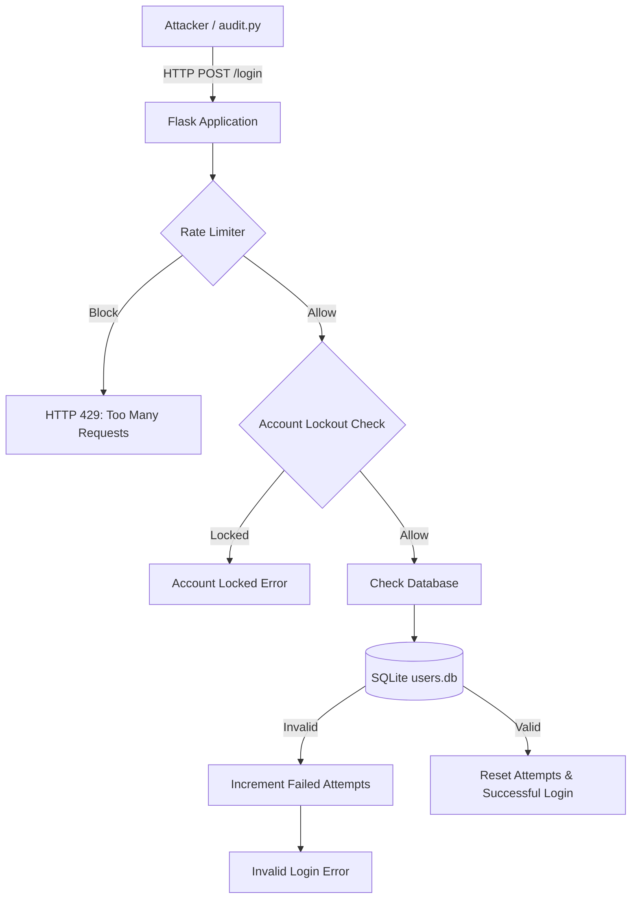
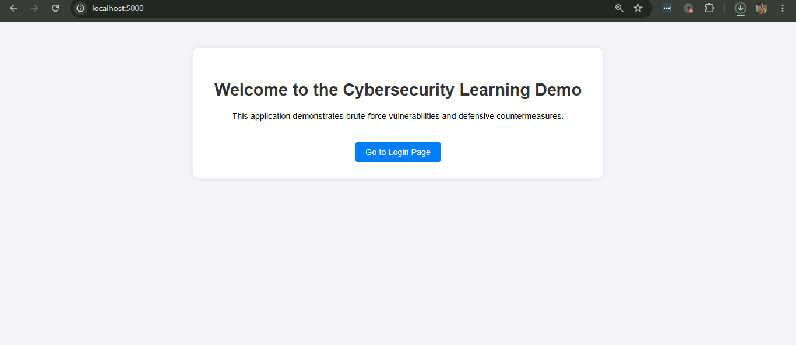
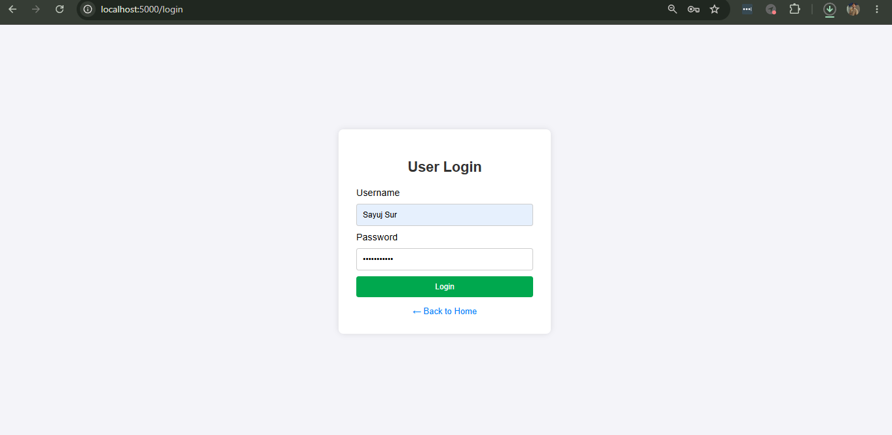

# 🛡️ BCT Day-4 — Web Application Security & Brute Force Mitigation

<p align="center">
  
  
  
  
</p>

> [!CAUTION]
> **Security Note — Educational Purposes Only**
> Brute-forcing and credential stuffing attacks are illegal when performed against systems you do not own or have explicit authorization to test. This project and its tools are strictly for educational purposes to demonstrate how these attacks function and how to defend against them effectively.

---

## 📋 Table of Contents

- [Project Overview](#-project-overview)
- [Tech Stack](#-tech-stack)
- [Architecture & Data Flow](#-architecture--data-flow)
- [Screenshots](#-screenshots)
- [Project Structure](#-project-structure)
- [Setup Instructions](#-setup-instructions)
- [Running the Application](#-running-the-application)
- [Security Audit & Defenses](#-security-audit--defenses)

---

## 🔍 Project Overview

This project is a simple Flask-based user login website built to demonstrate the critical importance of defensive measures on authentication endpoints. 

Without defenses, authentication endpoints are highly vulnerable to **Brute Force** and **Credential Stuffing** attacks. In this lab, we use a custom script (`audit.py`) to simulate these attacks and observe how the defenses built into `app.py` mitigate them.

### Implemented Defenses:
1. **Password Hashing:** Passwords are never stored in plaintext. They are hashed using `werkzeug.security`.
2. **Account Lockout:** After 5 failed login attempts, an account is temporarily locked to prevent continuous guessing.
3. **Rate Limiting:** IP-based rate limiting (via `Flask-Limiter`) slows down automated attack scripts.
4. **Audit Logging:** All successful, failed, and blocked login attempts are logged to `login_attempts.log` for SIEM/SOC analysis.

---

## 💻 Tech Stack

- **Backend:** Python, Flask
- **Database:** SQLite3
- **Security Features:** Flask-Limiter, Werkzeug Security (Password Hashing)
- **Frontend:** HTML5, Vanilla CSS
- **Testing Script:** Python `requests` module (`audit.py`)

---

## 🏗️ Architecture & Data Flow

The following diagram illustrates the request flow and how the defensive mechanisms mitigate brute-force attempts.



---

## 📸 Screenshots

Visual overview of the application in action:






---

## 📁 Project Structure

```text
BCT Day-4/
├── app.py             # Main Flask application with defensive measures
├── setup_db.py        # Script to create and seed the SQLite database
├── audit.py           # Penetration testing script to simulate brute force
├── usernames.txt      # 50 sample usernames
├── passwords.txt      # 50 sample plaintext passwords
├── users.db           # SQLite database (generated by setup_db.py)
├── login_attempts.log # Security log file (generated by app.py)
├── Bruteforce Burp_Suite/ # Lab guide using Burp Suite
└── templates/         # HTML templates
    ├── index.html     
    ├── login.html     
    └── dashboard.html 
```

---

## 🛠️ Setup Instructions

### 1. Install Prerequisites
Ensure you have Python 3 installed. You will need to install the required Python packages:

```bash
pip install flask flask-limiter requests werkzeug
```

### 2. Initialize the Database
Before running the app, you need to generate the SQLite database and seed it with the 50 users from the text files.

```bash
python setup_db.py
```
*Expected Output:* `Successfully seeded database with 50 users.`

---

## 🚀 Running the Application

Start the Flask web server:

```bash
python app.py
```
The application will be accessible at: `http://localhost:5000/`

You can manually navigate to the site, click "Go to Login Page", and try logging in with any user from `usernames.txt` and `passwords.txt` (e.g., `alice` / `password123`).

---

## 🛡️ Security Audit & Defenses

### Running the Attack Simulation

While the Flask application is running in one terminal, open a second terminal and run the security audit script:

```bash
python audit.py
```

### Bruteforce Audit Output

When running `python audit.py`, the system generates the following output, demonstrating the successful mitigation of the brute force attempts:

```text
========================================
SECURITY AUDIT: Starting Brute Force Test
========================================

[*] Targeting user: admin

[!] Phase 1: Testing Account Lockout Mechanism
[*] Attempting admin : wrongpass0 ... FAILED
[*] Attempting admin : wrongpass1 ... FAILED
[*] Attempting admin : wrongpass2 ... FAILED
[*] Attempting admin : wrongpass3 ... FAILED
[*] Attempting admin : wrongpass4 ... FAILED
[*] Attempting admin : wrongpass5 ... FAILED
[*] Attempting admin : wrongpass6 ... FAILED

[!] Phase 2: Testing Valid Credentials Pairing
[*] Attempting alice : password123 ... SUCCESS - VULNERABILITY FOUND!
[*] Attempting bob : qwerty ... SUCCESS - VULNERABILITY FOUND!
[*] Attempting charlie : iloveyou ... SUCCESS - VULNERABILITY FOUND!
[*] Attempting david : admin123 ... BLOCKED (Rate Limited by IP!)
[*] Attempting eve : 12345678 ... BLOCKED (Rate Limited by IP!)
[*] Attempting frank : letmein ... BLOCKED (Rate Limited by IP!)
[*] Attempting grace : welcome1 ... BLOCKED (Rate Limited by IP!)
...
(Remaining attempts were all BLOCKED by Rate Limiting)
```

### Understanding the Results

#### Phase 1: Account Lockout Testing
The script attempts to log in as the `admin` user with 7 incorrect passwords in rapid succession.
- **What happens:** The first 5 attempts return "Invalid username or password". The 6th and 7th attempts are instantly blocked by the application with an "Account locked" message.
- **Why it matters:** This prevents an attacker from infinitely guessing an account's password. Even if they know the username, they are locked out after a handful of attempts.

#### Phase 2: Rate Limiting & Valid Credentials
The script attempts to use the valid credential pairs from the text files.
- **What happens:** The first few might succeed (depending on the speed of the script), but quickly, the script hits the `Flask-Limiter` threshold (`10 per minute` on the login route). The server responds with `HTTP 429 Too Many Requests`.
- **Why it matters:** Rate limiting at the IP level prevents distributed brute-force attacks and credential stuffing by slowing down the attacker to an unfeasible speed.

### Checking the Logs
After running the audit, check the `login_attempts.log` file:
```bash
cat login_attempts.log
```
You will see a trail of `FAILED LOGIN`, `ACCOUNT LOCKED`, and `BLOCKED LOGIN` events. In a real-world scenario, these logs would be forwarded to a SIEM (like Splunk or Sentinel) to alert the Security Operations Center (SOC) of an ongoing attack.

---
<p align="center">
  Made with ❤️ for Cybersecurity Education | <strong>Sayuj Sur</strong>
</p>
