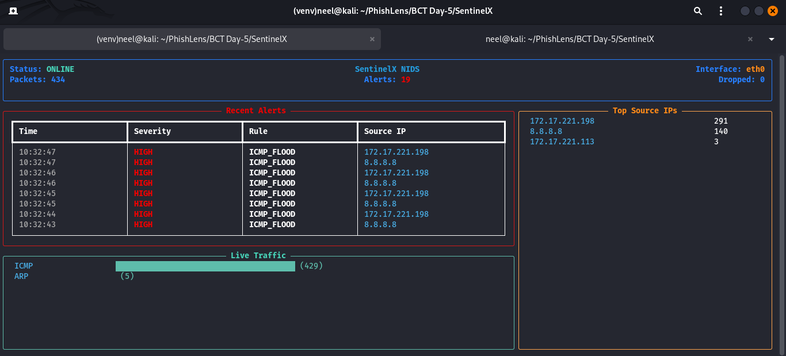

# 👁️ SentinelX

> **Lightweight Terminal-Based Network Intrusion Detection System**

<p align="center">
        ▲<br>
      /███\<br>
     /█████\<br>
    |  👁  |<br>
    |██████|<br>
     \████/<br>
      \██/<br>
       ||<br>
      /||\
</p>

## Overview
SentinelX is a production-quality, multi-threaded Network Intrusion Detection System (NIDS) designed for educational purposes. Inspired by Snort and themed with a classic "HackTheBox / Kali Linux" aesthetic, it captures live network traffic, parses packets, and evaluates them against YAML-based heuristic rules using a sliding-window detection engine.

### Key Features
- **Live Packet Capture**: Uses `scapy` to sniff TCP, UDP, ICMP, DNS, ARP, HTTP, and SSH.
- **Sliding-Window Engine**: Efficiently detects floods and bursts using time-based threshold counters.
- **Terminal Dashboard**: A real-time `rich` terminal UI displaying traffic stats, top talkers, and alerts.
- **Configurable Rules**: YAML-based signature definitions loaded dynamically.
- **Structured Logging**: Outputs alerts to text files and raw packets to JSON logs.

---

## 📸 Dashboard in Action

Here is SentinelX capturing live traffic and identifying a simulated ICMP Flood attack in real-time. Notice the beautiful, non-blocking asynchronous UI powered by `rich`.



*The dashboard displays the current interface, total packets, recent alerts with severity and source IP, a live traffic protocol distribution graph, and a leaderboard of top source IPs.*

---

## 🏗️ Architecture & Workflow

SentinelX is built using a clean, decoupled, multi-threaded architecture:

1. **Sniffer Module (`core/sniffer.py`)**: Runs on a dedicated daemon thread. It uses Scapy's asynchronous sniff capabilities to capture raw packets directly from the network interface (e.g., `eth0`) and pushes them into a thread-safe Queue.
2. **Parser Module (`core/parser.py`)**: As packets are pulled from the Queue, the parser flattens the complex multi-layer Scapy objects (Ethernet, IP, TCP/UDP/ICMP/DNS) into a unified, lightweight dictionary format. It safely serializes raw payloads to Hex Strings to prevent JSON logging crashes.
3. **Detection Engine (`core/engine.py`)**: The brain of the operation. It maintains stateful sliding-window counters (e.g., tracking how many ICMP packets a specific Source IP sent in the last 2 seconds). It evaluates the parsed packets against dynamic heuristic thresholds. If a threshold is crossed, it triggers an Alert.
4. **Rule Engine (`rules/rule_engine.py`)**: Dynamically parses and loads heuristic signatures from `rules/signatures.yaml`. This allows the user to tune detection thresholds (like packet counts and time windows) without modifying the Python source code.
5. **Terminal UI (`terminal/dashboard.py`)**: Runs on the main thread using `rich.live`. It continuously polls the Detection Engine for the latest stats, recent alerts, and traffic distributions, rendering a beautiful hacker-themed dashboard at 4 frames per second.
6. **Logger (`core/logger.py`)**: Persists triggered alerts to `logs/alerts.log` and archives all parsed packets in JSON format to `logs/packets_YYYYMMDD_HH.json` for forensic analysis.

---

## 📁 Project Structure

```text
SentinelX/
├── core/             # Core sniffing, parsing, engine, and logging
├── rules/            # YAML rules and Rule Engine
├── terminal/         # Rich terminal UI components
├── attacks/          # Simulated attack scripts (Lab Use Only!)
├── logs/             # Generated logs (alerts and JSON packets)
├── sentinel.py       # Main CLI entry point
└── requirements.txt  # Dependencies
```

## 🛠️ Installation & Setup

1. **Clone the Repository**
2. **Create a Virtual Environment**
   ```bash
   python -m venv venv
   source venv/bin/activate  # On Windows: venv\Scripts\activate
   ```
3. **Install Dependencies**
   ```bash
   pip install -r requirements.txt
   ```
   *(Note for Windows users: You must have Npcap installed, usually bundled with Wireshark, for `scapy` to capture packets. Linux users just need `sudo`).*

## 🚀 Usage

### 1. Start the IDS
Run SentinelX with administrator/root privileges (required for raw packet sniffing):
```bash
sudo venv/bin/python sentinel.py start --iface eth0
```
*(Replace `eth0` with your active network interface. If you are testing locally against yourself, you may need to use `lo` instead of `eth0`).*

### 2. Verify Rules
To check if the YAML rules are parsed correctly:
```bash
python sentinel.py check-rules
```

---

## ⚔️ Lab Testing (Attack Simulators)

> [!CAUTION]
> **UNAUTHORIZED USE IS STRICTLY PROHIBITED.**
> The scripts in the `attacks/` directory generate real network attacks (Floods and Scans). They must **ONLY** be run on local, isolated lab environments that you own or have explicit authorization to test.

We have included several simulation scripts to test SentinelX's detection capabilities. Open a second terminal, activate the virtual environment, and run:

```bash
# 1. ICMP Flood (Ping Flood)
sudo venv/bin/python attacks/icmp_flood.py --target 8.8.8.8 --count 0 --delay 0

# 2. TCP SYN Flood
sudo venv/bin/python attacks/syn_flood.py --target 8.8.8.8 --port 80 --count 0 --delay 0

# 3. UDP Flood
sudo venv/bin/python attacks/udp_flood.py --target 8.8.8.8 --port 80 --count 0 --delay 0

# 4. DNS Flood
sudo venv/bin/python attacks/dns_flood.py --target 8.8.8.8 --count 0 --delay 0

# 5. Port Scan (1-1024)
sudo venv/bin/python attacks/port_scan.py --target 8.8.8.8 --delay 0

# 6. Botnet DDoS Simulator (Random Spoofed Source IPs)
sudo venv/bin/python attacks/ddos_sim.py --target 8.8.8.8 --port 80 --count 0 --delay 0
```

*(Note: The `--count 0` flag makes the attack run infinitely until you press `Ctrl+C`. The `--delay 0` flag fires packets as fast as Python allows).*

### 🔧 Tuning Detection Thresholds
If you are running the attacks from a slow Virtual Machine, Scapy might not send packets fast enough to trigger the default rules. You can lower the thresholds manually:
1. Open `rules/signatures.yaml` (Use `sudo nano` if it was created by root).
2. Change the `threshold` for a specific attack (e.g., `ICMP_FLOOD`) from `100` to `20`.
3. Restart SentinelX and try the attack again.

---

## 📜 Educational Note
SentinelX was built to demonstrate Systems Programming, Network Security, and Clean Architecture in Python. Its heuristic-based engine shows the fundamentals of how professional NIDS/NIPS (like Snort or Suricata) evaluate stateful traffic patterns.
