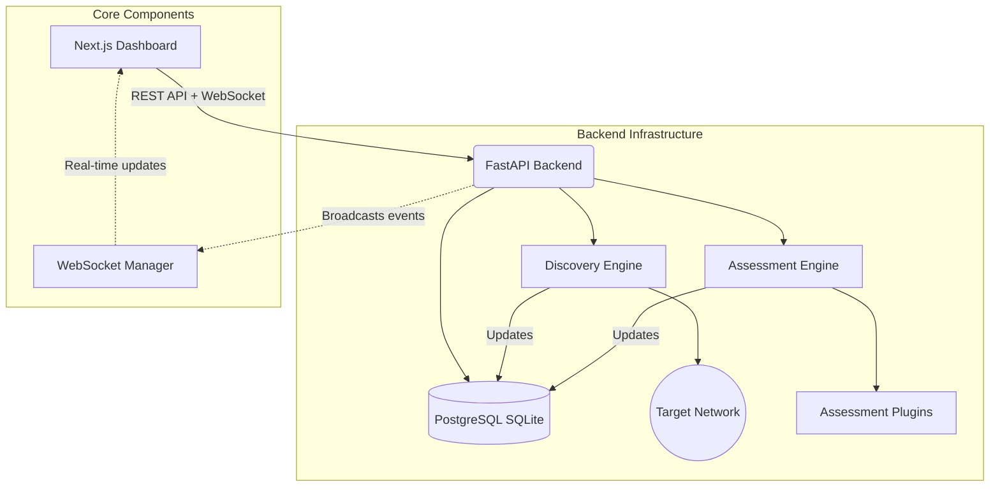
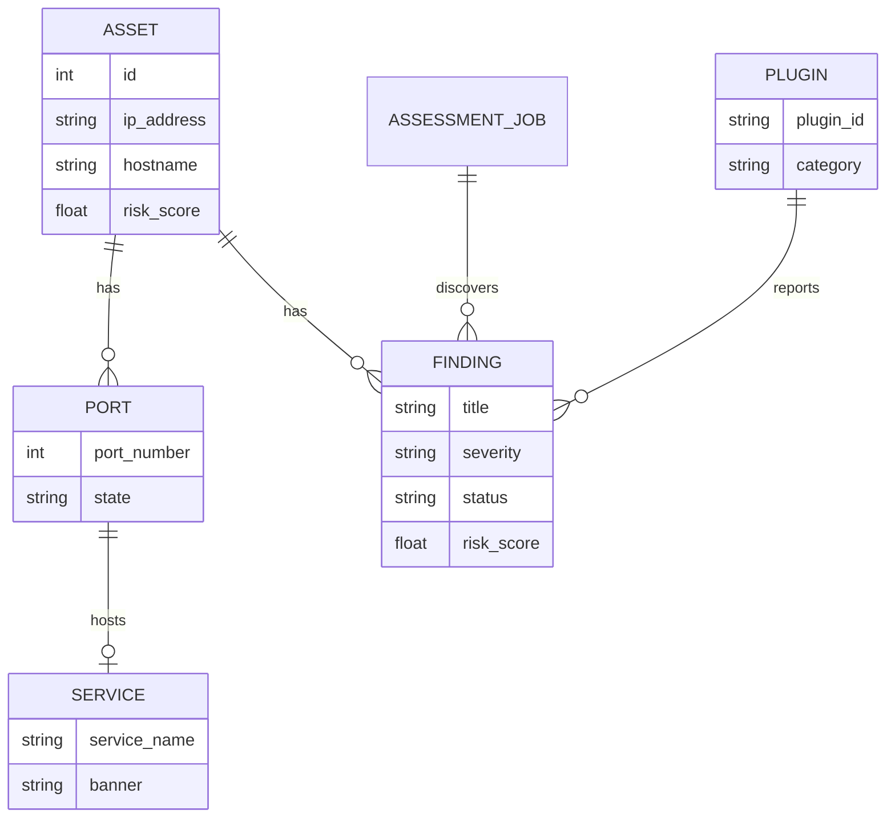

# BlackFalcon Architecture

BlackFalcon is an enterprise vulnerability management platform with a decoupled backend/frontend architecture.

## System Overview

```mermaid
graph TD
    UI[Next.js Dashboard] --> |REST API + WebSocket| API(FastAPI Backend)
    
    subgraph Backend Infrastructure
    API --> DB[(PostgreSQL SQLite)]
    API --> DE[Discovery Engine]
    API --> AE[Assessment Engine]
    DE --> Network((Target Network))
    AE --> Plugins[Assessment Plugins]
    end
    
    subgraph Core Components
    DE --> |Updates| DB
    AE --> |Updates| DB
    API -.-> |Broadcasts events| WS[WebSocket Manager]
    WS -.-> |Real-time updates| UI
    end
```

## Entity Relationship Diagram

```mermaid
erDiagram
    ASSET ||--o{ PORT : has
    PORT ||--o| SERVICE : hosts
    ASSET ||--o{ FINDING : has
    ASSESSMENT_JOB ||--o{ FINDING : discovers
    PLUGIN ||--o{ FINDING : reports

    ASSET {
        int id
        string ip_address
        string hostname
        float risk_score
    }
    PORT {
        int port_number
        string state
    }
    SERVICE {
        string service_name
        string banner
    }
    FINDING {
        string title
        string severity
        string status
        float risk_score
    }
    PLUGIN {
        string plugin_id
        string category
    }
```
