# 🔍 OSINT Tools Demo — Kali Linux (BCT Day 8 & 9)

> A practical walkthrough of OSINT tools installed and tested on Kali Linux (native).  
> All commands were run against **public/legal targets** for demonstration purposes only.

---

## 🚨 CAUTION — READ BEFORE PROCEEDING

> [!CAUTION]
> **OSINT (Open Source Intelligence) gathering, when performed without authorization, is COMPLETELY ILLEGAL.**
>
> - This document is **strictly for educational purposes only**.
> - Unauthorized use of these tools against targets you do not own or have **explicit written permission** to test violates:
>   - 🇺🇸 **Computer Fraud and Abuse Act (CFAA)** — USA
>   - 🇬🇧 **Computer Misuse Act 1990** — UK
>   - 🇮🇳 **Information Technology Act 2000, Section 66** — India
>   - And similar cybercrime laws **worldwide**
> - **You can face criminal prosecution, fines, and imprisonment.**
> - The author and this repository accept **NO responsibility** for any misuse of the information presented here.
>
> ⚠️ **Always get written authorization before scanning any target. When in doubt — DON'T.**

---

## 📋 Table of Contents

1. [Tools Overview](#-tools-overview)
2. [theHarvester](#1-theharvester)
3. [DNSrecon](#2-dnsrecon)
4. [Sherlock](#3-sherlock)
5. [Holehe](#4-holehe)
6. [Maigret](#5-maigret)
7. [Dmitry](#6-dmitry)
8. [WhatWeb](#7-whatweb)
9. [Full Demo Workflow](#-full-demo-workflow)
10. [Safe Practice Targets](#-safe-practice-targets)
11. [Tool Installation Summary](#-tool-installation-summary)
12. [Screenshot Index](#-screenshot-index)

---

## 🛠 Tools Overview

| Tool | Category | Purpose | API Key Needed |
|------|----------|---------|---------------|
| theHarvester | Domain Recon | Emails, subdomains, IPs from public sources | Optional |
| DNSrecon | DNS Recon | DNS records, zone transfers, brute force | No |
| Sherlock | Social Media | Username search across 300+ sites | No |
| Holehe | Email Intel | Email registration checker across 121 sites | No |
| Maigret | Social Media | Deep username OSINT + dossier generation | No |
| Dmitry | Infrastructure | Whois, ports, subdomains, emails | No |
| WhatWeb | Web Intel | Website fingerprinting & tech stack detection | No |

---

## 1. theHarvester

**Purpose:** Gather subdomains, IPs, emails, and open-source intel from public sources.  
**Pre-installed on Kali:** ✅ Yes (v4.6.0)

### 📸 Screenshots

**Help menu — all available options and sources:**

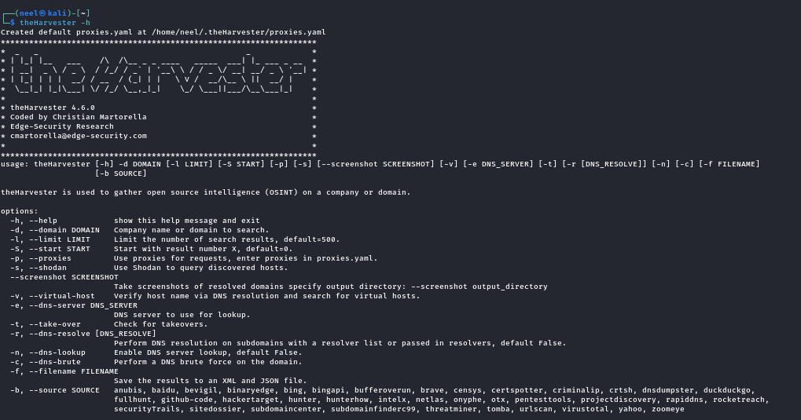

**Invalid source error (`google,bing,duckduckgo` are NOT valid in v4.6.0) + crtsh/urlscan API errors:**

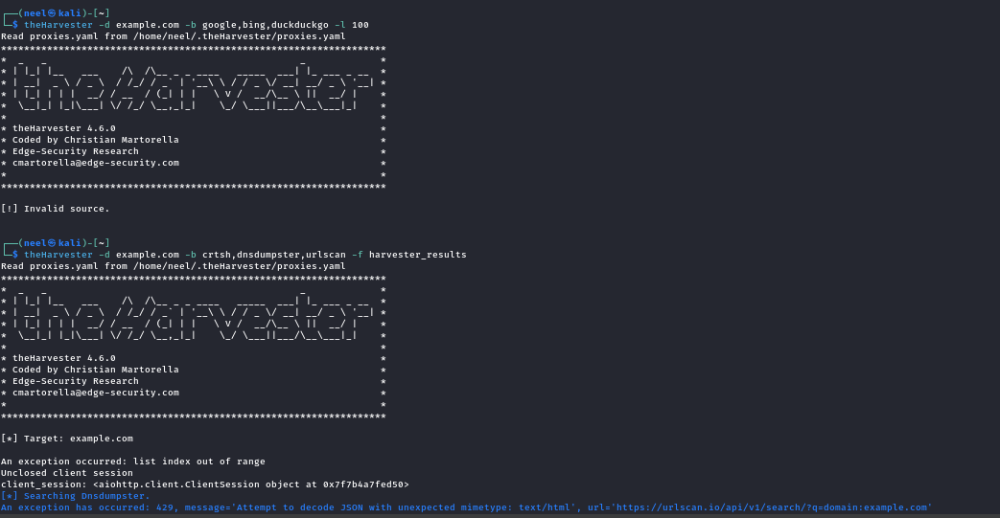

**crtsh 502 error and subdomain takeover check output:**

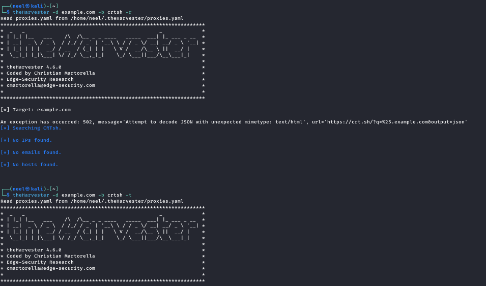

**`-b list` flag error + hackertarget scan initiated on tesla.com:**

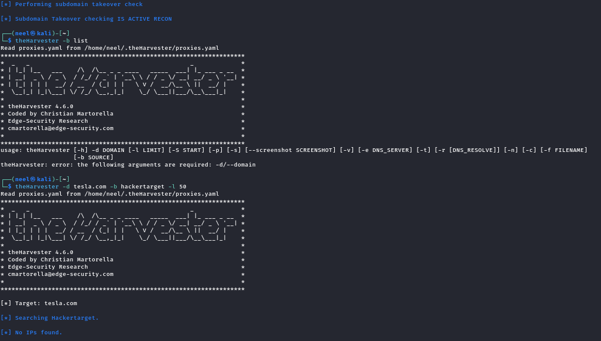

**✅ hackertarget found 60 subdomains for tesla.com:**

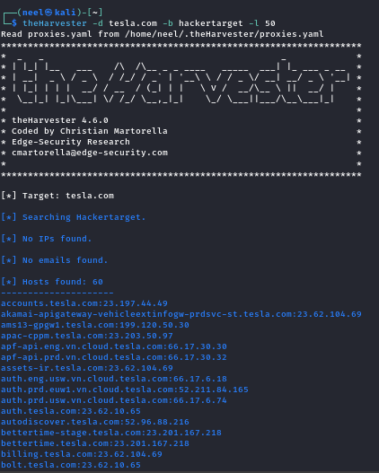

**anubis 403 rate limit error on tesla.com:**

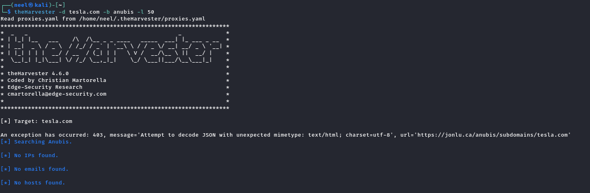

**✅ rapiddns found 97 subdomains for tesla.com:**

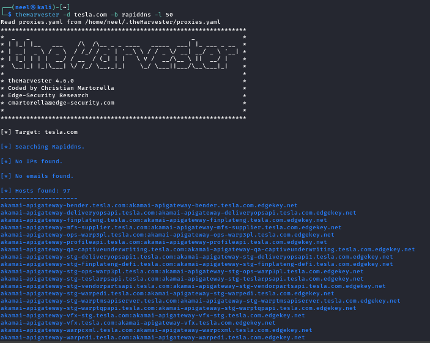

### 🔧 Verify Installation
```bash
theHarvester -h
```

### ✅ Working Sources (No API Key Required)
```
hackertarget, rapiddns, anubis, dnsdumpster, subdomaincenter,
sitedossier, threatminer, urlscan, certspotter
```

### 📟 Instructions & Demo Commands

```bash
# Step 1 — Verify it's installed and check all flags
theHarvester -h

# Step 2 — Find subdomains using hackertarget (most reliable, no API key)
theHarvester -d tesla.com -b hackertarget -l 50

# Step 3 — Find subdomains using rapiddns (returns most results)
theHarvester -d tesla.com -b rapiddns -l 50

# Step 4 — Combine multiple reliable sources
theHarvester -d tesla.com -b hackertarget,rapiddns -l 100 -f tesla_report

# Step 5 — With DNS resolution on found subdomains
theHarvester -d tesla.com -b hackertarget -r

# Step 6 — Check for subdomain takeover vulnerabilities
theHarvester -d tesla.com -b hackertarget -t

# Step 7 — Save results to XML and JSON
theHarvester -d tesla.com -b hackertarget -f output_results
```

### ⚠️ Known Issues (v4.6.0)
- `google`, `bing`, `duckduckgo` are **NOT valid** source names — use `hackertarget` or `rapiddns`
- `crtsh` and `urlscan` may return 502/429 errors due to rate limiting
- Best free sources with consistent results: **`hackertarget`** and **`rapiddns`**

---

## 2. DNSrecon

**Purpose:** DNS enumeration — SOA, NS, MX, A records, zone transfers, brute force subdomain discovery.  
**Pre-installed on Kali:** ✅ Yes

### 📸 Screenshots

**Help menu — all flags and enumeration types:**

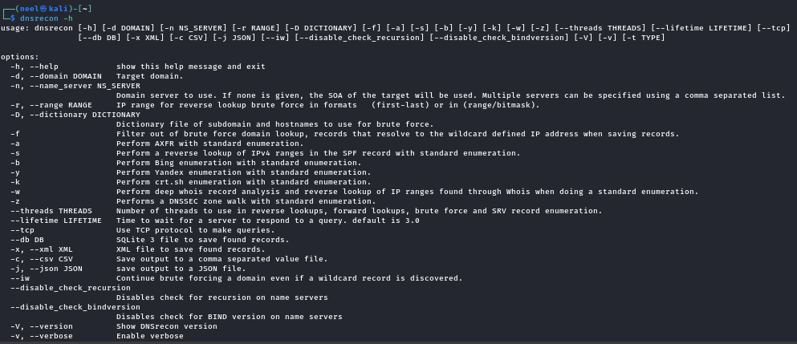

**✅ Standard enumeration (`-t std`) on tesla.com — SOA, NS (Akamai/UltraDNS), MX (Office365), A records:**

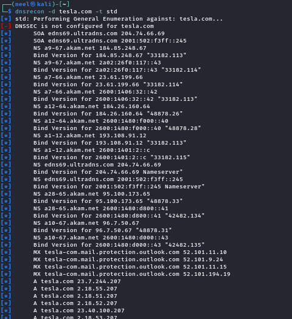

### 🔧 Verify Installation
```bash
dnsrecon -h
dnsrecon -V
```

### 📟 Instructions & Demo Commands

```bash
# Step 1 — Verify installation and check version
dnsrecon -V

# Step 2 — Standard enumeration (SOA, NS, A, AAAA, MX, SRV records)
dnsrecon -d tesla.com -t std

# Step 3 — Check for zone transfer vulnerability (critical misconfiguration)
dnsrecon -d tesla.com -t axfr

# Step 4 — Brute force subdomains with built-in wordlist
dnsrecon -d tesla.com -t brt -D /usr/share/wordlists/dnsmap.txt

# Step 5 — Certificate Transparency lookup (finds subdomains via SSL certs)
dnsrecon -d tesla.com -t crt

# Step 6 — Bing subdomain enumeration
dnsrecon -d tesla.com -t bing

# Step 7 — Save output to JSON for reporting
dnsrecon -d tesla.com -t std -j dns_results.json

# Step 8 — Save output to CSV
dnsrecon -d tesla.com -t std -c dns_results.csv

# Step 9 — Verbose output for more detail
dnsrecon -d tesla.com -t std -v
```

### 🔎 What `-t std` Reveals (tesla.com Example)

| Record | Value |
|--------|-------|
| SOA | edns69.ultradns.net |
| NS | a9-67.akam.net, a12-64.akam.net (Akamai CDN) |
| MX | tesla-com.mail.protection.outlook.com (Microsoft Office 365) |
| A | 23.7.244.207, 2.18.51.207, 2.18.52.207 |

---

## 3. Sherlock

**Purpose:** Hunt usernames across 300+ social media platforms simultaneously.  
**Pre-installed on Kali:** ❌ (installed via `apt` during demo)

### 📸 Screenshots

**Sherlock installation via apt:**

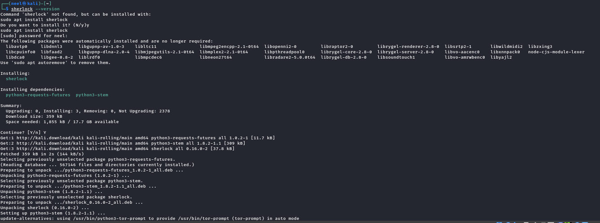

**✅ Sherlock running on `elonmusk` — first batch of found profiles (7Cups, 9GAG, ArtStation, Behance, etc.):**

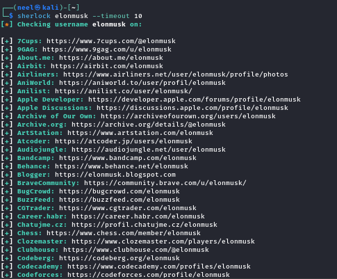

**✅ Sherlock search completed — 185 results found across platforms:**

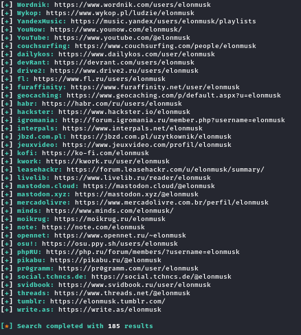

### 🔧 Install
```bash
sudo apt install sherlock -y
```

### 📟 Instructions & Demo Commands

```bash
# Step 1 — Install Sherlock
sudo apt install sherlock -y

# Step 2 — Basic username search
sherlock elonmusk

# Step 3 — With timeout for faster results (skips slow sites)
sherlock elonmusk --timeout 10

# Step 4 — Print only found/confirmed accounts
sherlock elonmusk --print-found

# Step 5 — Search multiple usernames at once
sherlock elonmusk billgates zuckerberg

# Step 6 — Save results to a text file
sherlock elonmusk --output sherlock_results.txt

# Step 7 — Use Tor for anonymity (requires tor service running)
sherlock elonmusk --tor
```

---

## 4. Holehe

**Purpose:** Check if an email address is registered on various websites — without sending any emails or triggering account alerts.  
**Installed via:** `pip3`

### 📸 Screenshots

**Holehe installation via pip3 with `--break-system-packages`:**

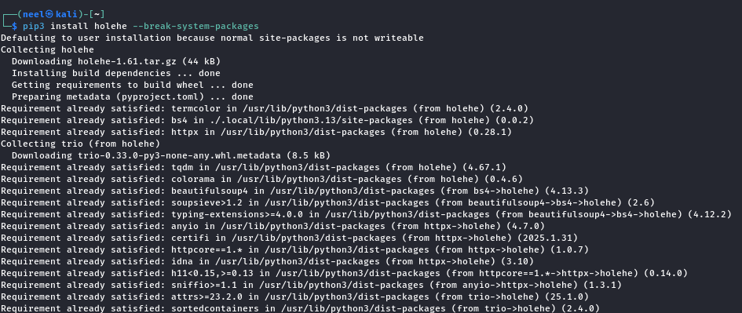

**Holehe running — showing `[+]` email used, `[-]` not used, `[x]` rate limited:**

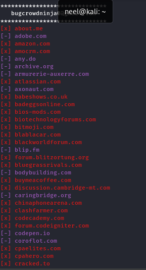

**✅ Holehe scan completed — 121 websites checked in 17.49 seconds:**

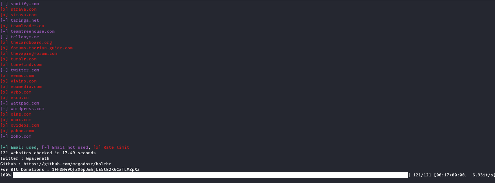

### 🔧 Install
```bash
pip3 install holehe --break-system-packages
```

### 📟 Instructions & Demo Commands

```bash
# Step 1 — Install Holehe
pip3 install holehe --break-system-packages

# Step 2 — Check a single email address
holehe test@gmail.com

# Step 3 — Show only positive hits (email IS registered)
holehe test@gmail.com --only-used

# Step 4 — Verbose output with more detail
holehe test@gmail.com -v

# Step 5 — Export results to CSV file
holehe test@gmail.com --csv
```

### 📖 Output Legend

| Symbol | Meaning |
|--------|---------|
| `[+]` | Email **IS** registered on this site |
| `[-]` | Email is **NOT** registered |
| `[x]` | Rate limited — could not verify |

---

## 5. Maigret

**Purpose:** Collect a comprehensive dossier on a person from username alone — searches across 3000+ sites and extracts profile metadata (followers, bio, verified status, join date, etc.).  
**Installed via:** `git clone` + `pip3 install`

### 📸 Screenshots

**Git clone of maigret repo + pip3 install (using pyproject.toml):**

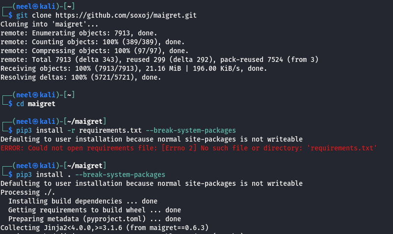

**✅ `maigret --version` confirms v0.6.3 installed:**

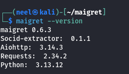

**✅ `maigret elonmusk --pdf` running — DB auto-updated to 3221 sites, found SoundCloud, Instagram (133K followers, verified), GitHub profiles:**

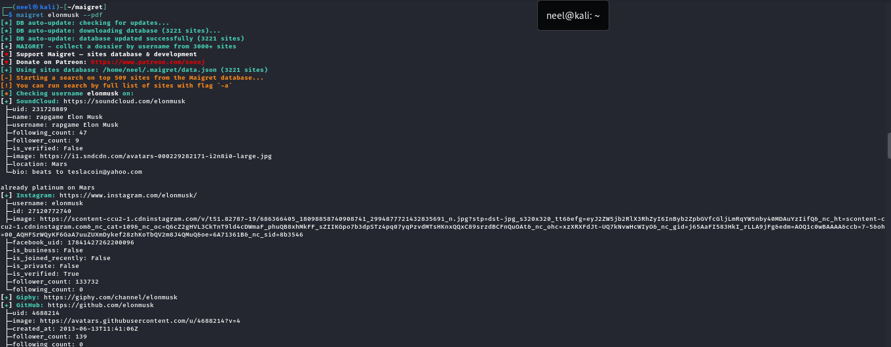

### 🔧 Install
```bash
git clone https://github.com/soxoj/maigret.git
cd maigret
pip3 install . --break-system-packages
```

### 📟 Instructions & Demo Commands

```bash
# Step 1 — Clone and install Maigret from source
git clone https://github.com/soxoj/maigret.git
cd maigret
pip3 install . --break-system-packages

# Step 2 — Verify installation
maigret --version

# Step 3 — Basic username search (console output)
maigret elonmusk

# Step 4 — Generate PDF report (best for demo/presentation)
maigret elonmusk --pdf

# Step 5 — Generate HTML report
maigret elonmusk --html

# Step 6 — Limit to top sites for faster results
maigret elonmusk --top-sites 100

# Step 7 — Search multiple usernames
maigret elonmusk billgates --top-sites 50

# Step 8 — Search all 3000+ sites (slow, thorough)
maigret elonmusk -a

# Step 9 — Save reports to a specific folder
maigret elonmusk --pdf --html -J ~/maigret_reports/
```

### 🔎 Maigret vs. Sherlock Comparison

| Feature | Sherlock | Maigret |
|---------|----------|---------| 
| Sites checked | ~300 | 3,000+ |
| Profile metadata extracted | ❌ | ✅ (followers, bio, verified, etc.) |
| PDF/HTML report generation | ❌ | ✅ |
| Auto DB update | ❌ | ✅ |
| Installation | `apt` | `git clone` + `pip3` |

---

## 6. Dmitry

**Purpose:** All-in-one information gathering — Whois lookup, Netcraft info, subdomain search, email harvesting, and TCP port scanning in a single tool.  
**Pre-installed on Kali:** ✅ (upgraded during demo)

### 📸 Screenshots

**pipx upgraded successfully:**

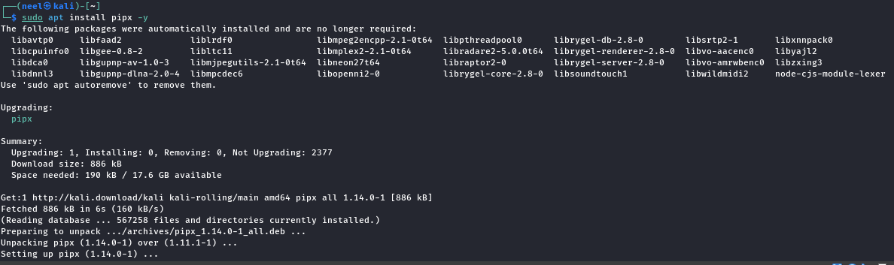

**Dmitry upgraded via apt:**

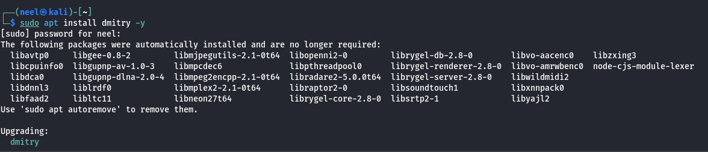

**Dmitry help menu — all available flags (`-w`, `-i`, `-n`, `-s`, `-e`, `-p`, `-f`, `-b`):**

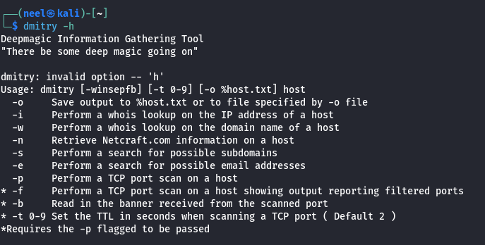

**✅ `dmitry -winsepfb tesla.com` — HostIP: 2.18.54.207, Akamai WHOIS (Cambridge MA), IP range, Netcraft info, TCP ports filtered:**

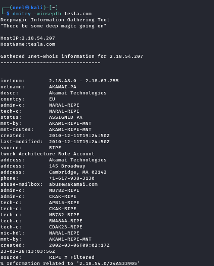

**✅ Dmitry WHOIS for tesla.com — Domain created 1992-11-04, Registrar: MarkMonitor, Nameservers: Akamai + UltraDNS:**

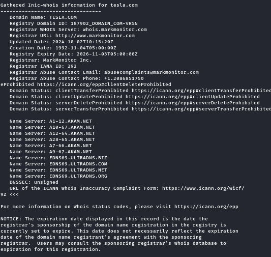

**Dmitry continued — Netcraft info, subdomain/email search (0 results via Google/Altavista), TCP port scan (ports 1-5/tcp filtered):**

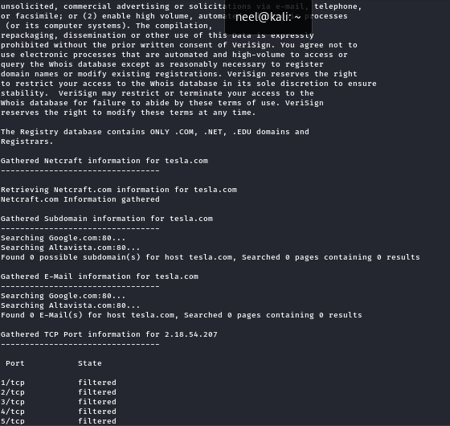

### 🔧 Install / Upgrade
```bash
sudo apt install dmitry -y
```

### 📟 Instructions & Demo Commands

```bash
# Step 1 — Install or upgrade Dmitry
sudo apt install dmitry -y

# Step 2 — Run all modules at once (best for a full demo)
dmitry -winsepfb tesla.com

# Step 3 — Individual modules:

# Whois lookup on domain name
dmitry -w tesla.com

# Whois lookup on IP address
dmitry -i 2.18.54.207

# Netcraft info (hosting history, OS info)
dmitry -n tesla.com

# Search for subdomains
dmitry -s tesla.com

# Search for email addresses
dmitry -e tesla.com

# TCP port scan (ports 1-1024)
dmitry -p tesla.com

# TCP scan showing filtered ports as well
dmitry -f tesla.com

# Banner grabbing (requires -p flag)
dmitry -pb tesla.com

# Step 4 — Save all output to a file
dmitry -winsepfb -o dmitry_output.txt tesla.com
```

### 🚩 Dmitry Flags Reference

| Flag | Action |
|------|--------|
| `-w` | Whois lookup on domain |
| `-i` | Whois lookup on IP address |
| `-n` | Gather Netcraft info |
| `-s` | Search for subdomains |
| `-e` | Search for email addresses |
| `-p` | TCP port scan (1–1024) |
| `-f` | Show filtered ports in scan |
| `-b` | Grab service banners |
| `-o` | Save output to file |

---

## 7. WhatWeb

**Purpose:** Website fingerprinting — identifies CMS, frameworks, server tech, analytics providers, CDN, and security headers from a target URL.  
**Pre-installed on Kali:** ✅ (v0.6.3)

### 📸 Screenshots

**WhatWeb version check + testphp.vulnweb.com timeout + ✅ example.com scan showing Cloudflare + HTML5 + cf-cache-status headers:**

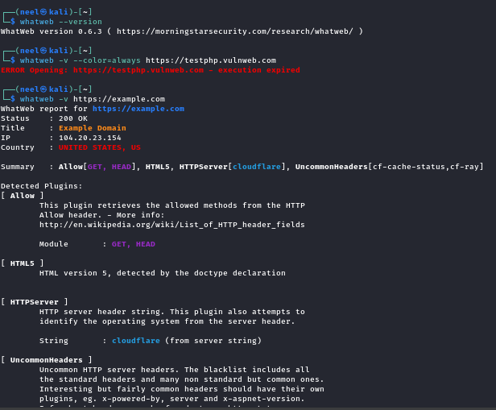

**✅ WhatWeb aggressive scan (`-a 3`) on nmap.org — Apache/2.4.6 on CentOS, Google Analytics (UA-11009417-1), HSTS header, ld+json script:**

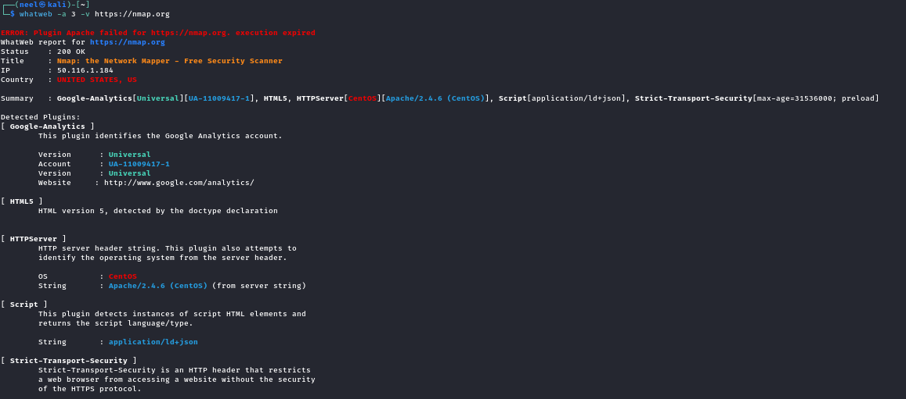

### 🔧 Verify Installation
```bash
whatweb --version
```

### 📟 Instructions & Demo Commands

```bash
# Step 1 — Verify WhatWeb is installed
whatweb --version

# Step 2 — Basic scan of a target URL
whatweb https://example.com

# Step 3 — Verbose output (shows all detected plugins in detail)
whatweb -v https://nmap.org

# Step 4 — Aggressive mode (level 3 = maximum information extraction)
whatweb -a 3 -v https://nmap.org

# Step 5 — Scan with forced color output for readability
whatweb -v --color=always https://example.com

# Step 6 — Save results to JSON file for reporting
whatweb -v https://nmap.org --log-json=whatweb_results.json

# Step 7 — Scan multiple targets at once
whatweb https://nmap.org https://httpbin.org https://php.net

# Step 8 — Quiet mode (compact one-liner output per target)
whatweb -q https://nmap.org
```

### 🔎 What WhatWeb Reveals (nmap.org Example)

| Plugin | Value |
|--------|-------|
| Server | Apache/2.4.6 (CentOS) |
| Analytics | Google Analytics UA-11009417-1 |
| Security Header | Strict-Transport-Security (HSTS) |
| Tech | HTML5, application/ld+json |
| IP | 50.116.1.184 |
| Country | United States |

---

## 🔁 Full Demo Workflow

A complete OSINT demo using all 7 tools against legal targets:

```bash
# ============================================================
# ⚠️  FOR EDUCATIONAL USE ONLY — LEGAL TARGETS ONLY
# TARGET: tesla.com (public domain, passive recon only)
# ============================================================

# STEP 1 — DNS Enumeration (DNSrecon)
echo "[*] Step 1: DNS Enumeration"
dnsrecon -d tesla.com -t std
# Screenshot: Screenshot_2026_07_30-9

# STEP 2 — Subdomain Discovery (theHarvester)
echo "[*] Step 2: Subdomain Discovery"
theHarvester -d tesla.com -b hackertarget,rapiddns -l 100 -f tesla_harvest
# Screenshots: Screenshot_2026_07_30-6, Screenshot_2026_07_30-8

# STEP 3 — Infrastructure Info (Dmitry)
echo "[*] Step 3: Infrastructure Recon"
dmitry -winsepfb tesla.com
# Screenshots: Screenshot_2026_07_30-19, Screenshot_2026_07_30-20

# STEP 4 — Web Fingerprinting (WhatWeb)
echo "[*] Step 4: Web Fingerprinting"
whatweb -a 3 -v https://nmap.org
# Screenshot: Screenshot_2026_07_30-27

# ============================================================
# TARGET: elonmusk (public figure — username OSINT only)
# ============================================================

# STEP 5 — Username Hunt (Sherlock)
echo "[*] Step 5: Username Search"
sherlock elonmusk --timeout 10
# Screenshots: Screenshot_2026_07_30-11, Screenshot_2026_07_30-12

# STEP 6 — Deep Username Dossier (Maigret)
echo "[*] Step 6: Deep OSINT Dossier"
maigret elonmusk --pdf --top-sites 100
# Screenshot: Screenshot_2026_07_30-24

# STEP 7 — Email Registration Check (Holehe)
echo "[*] Step 7: Email Intel"
holehe target@email.com
# Screenshots: Screenshot_2026_07_30-14, Screenshot_2026_07_30-15
```

---

## 🛡 Safe Practice Targets

> [!IMPORTANT]
> Always use **authorized or designated-safe** targets for practice. Never scan targets without permission.

| Target | Type | Why It's Safe |
|--------|------|--------------|
| `tesla.com` | Domain | Large public company — **passive recon only** |
| `nmap.org` | Domain | Security tool site, publicly tested regularly |
| `scanme.nmap.org` | Host | **Officially permitted** by Nmap for scanning practice |
| `example.com` | Domain | IANA reserved test domain |
| `httpbin.org` | Web Service | HTTP testing service — designed for tool testing |
| `elonmusk` | Username | Public figure with public social media profiles |

---

## 📦 Tool Installation Summary

```bash
# ============================================================
# Complete setup script for all OSINT tools
# Run on Kali Linux
# ============================================================

# Step 1 — Update system packages
sudo apt update && sudo apt upgrade -y

# Step 2 — Install tools available via APT
sudo apt install sherlock dmitry whatweb dnsrecon theharvester nmap -y

# Step 3 — Install Holehe via pip3
pip3 install holehe --break-system-packages

# Step 4 — Install Maigret from source
git clone https://github.com/soxoj/maigret.git
cd maigret
pip3 install . --break-system-packages
cd ~

# Step 5 — Verify all installations
echo "=== theHarvester ===" && theHarvester --help 2>/dev/null | grep "version" || echo "check manually"
echo "=== DNSrecon ===" && dnsrecon -V
echo "=== Sherlock ===" && sherlock --version
echo "=== Holehe ===" && holehe --help 2>/dev/null | head -1
echo "=== Maigret ===" && maigret --version | head -1
echo "=== Dmitry ===" && dmitry 2>&1 | head -2
echo "=== WhatWeb ===" && whatweb --version
echo "=== Nmap ===" && nmap --version | head -1
```

---

## 📸 Screenshot Index

| # | Screenshot | Tool | Description |
|---|------------|------|-------------|
| 1 |  | theHarvester | Help menu — all options, flags, and available sources |
| 2 |  | DNSrecon | Help menu — all flags and enumeration types |
| 3 |  | theHarvester | Invalid source error + crtsh/urlscan API errors |
| 4 |  | theHarvester | crtsh 502 error + subdomain takeover check output |
| 5 |  | theHarvester | `-b list` error + hackertarget scan initiation |
| 6 |  | theHarvester | **hackertarget: 60 subdomains found for tesla.com** ✅ |
| 7 |  | theHarvester | anubis 403 rate limit error |
| 8 |  | theHarvester | **rapiddns: 97 subdomains found for tesla.com** ✅ |
| 9 |  | DNSrecon | **std scan on tesla.com — SOA, NS, MX, A records** ✅ |
| 10 |  | Sherlock | Installation via apt |
| 11 |  | Sherlock | **elonmusk search — first batch of 185 results** ✅ |
| 12 |  | Sherlock | **elonmusk search — completed with 185 total results** ✅ |
| 13 |  | Holehe | Installation via pip3 |
| 14 |  | Holehe | **Email scan running — [+]/[-]/[x] results per site** ✅ |
| 15 |  | Holehe | **121 websites checked in 17.49 seconds** ✅ |
| 16 |  | pipx | pipx upgraded to v1.14.0 |
| 17 |  | Dmitry | Dmitry upgraded via apt |
| 18 |  | Dmitry | Help menu showing all flags |
| 19 |  | Dmitry | **tesla.com full scan — Akamai WHOIS, IP 2.18.54.207, ports** ✅ |
| 20 |  | Dmitry | **tesla.com domain WHOIS — created 1992, MarkMonitor** ✅ |
| 21 |  | Dmitry | Netcraft info, subdomain/email search, TCP port scan output |
| 22 |  | Maigret | Git clone + pip3 install from source |
| 23 |  | Maigret | **`maigret --version`: v0.6.3 confirmed** ✅ |
| 24 |  | Maigret | **elonmusk dossier — SoundCloud, Instagram (133K), GitHub** ✅ |
| 25 |  | WhatWeb | Version check + example.com scan (Cloudflare detected) ✅ |
| 27 |  | WhatWeb | **nmap.org aggressive scan — Apache/CentOS, Analytics** ✅ |

---

> [!NOTE]
> This README was generated from a **live Kali Linux demo session** conducted on **July 30, 2026** as part of BCT Day 8 & 9.  
> All tools were tested on real public targets with **no active exploitation** performed.

---

> [!CAUTION]
> 🚫 **FINAL REMINDER: OSINT without authorization is ILLEGAL.**  
> This document exists **solely for educational and awareness purposes.**  
> Use these techniques **only** in CTFs, authorized penetration tests, or on infrastructure you personally own.
