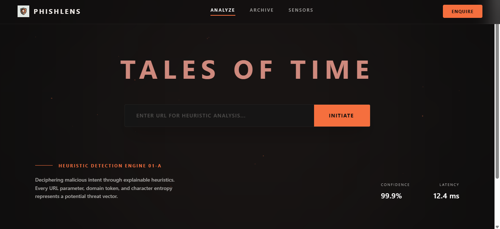
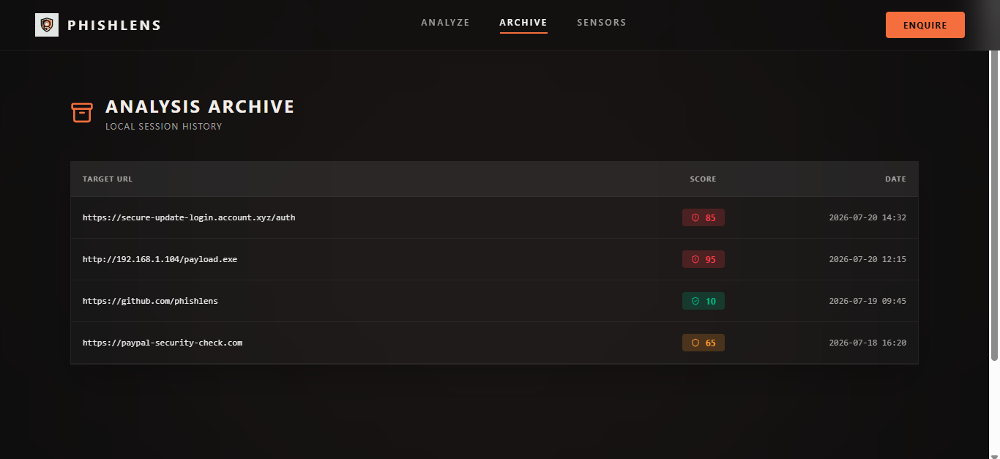
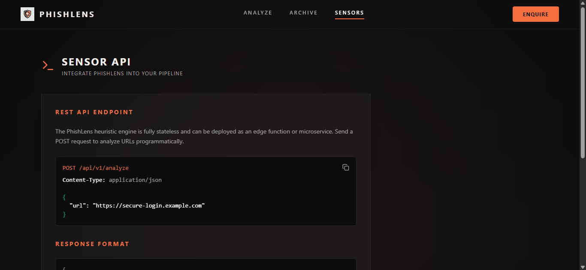
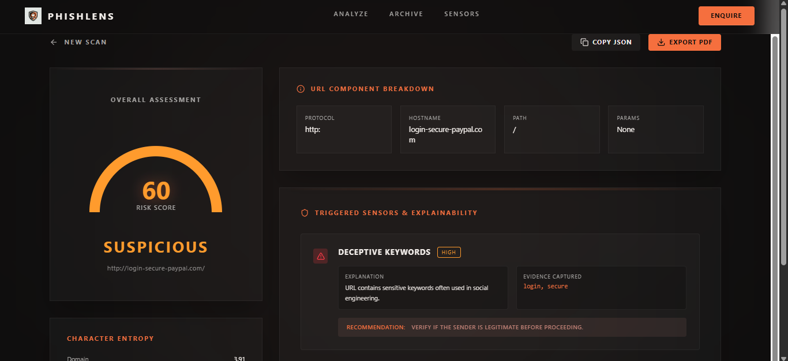
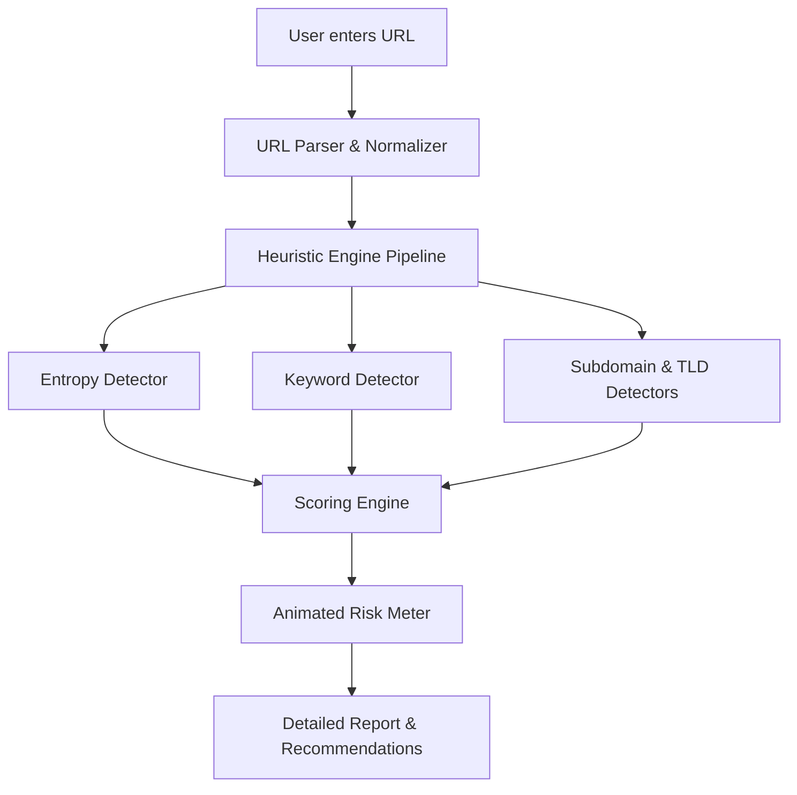

# PhishLens

<p align="center">
  
</p>

> ## 🎓 Academic Project Notice
>
> **PhishLens** was developed as part of the **Bachelor of Computer Applications (BCA/BCT) Training Program** under **JIS University**.
>
> Developed by **Sayuj Sur**.
>
> This repository is intended for cybersecurity education, research, and demonstration of explainable heuristic phishing URL detection.

---

<p align="center">
  
  
  
  
  
  
  
  
  
  
  
  
</p>

## Project Overview

**PhishLens** is a completely stateless, privacy-first cybersecurity platform that analyzes URLs using a proprietary explainable heuristic engine.

### Why does it exist?
Most modern URL scanners (like VirusTotal or Google Safe Browsing) operate as black boxes—they check a URL against a database of known malicious domains and return a binary safe/unsafe result. PhishLens solves the problem of **explainability**. Instead of relying on reputation APIs or databases, it analyzes the structural anatomy of the URL in real-time, explaining *why* a URL is suspicious.

### The PhishLens Difference
- **No Third-Party APIs**: Every score is deterministically calculated through our own heuristic algorithms.
- **Privacy First**: URLs are never stored, sent to third-party providers, or aggregated.
- **Fully Stateless**: Analysis happens locally, leaving zero footprint.
- **Explainable Scoring**: Every point added to the risk score is justified with direct evidence and mitigation recommendations.

## Features

- 🧠 **Explainable Heuristic Engine**: Real-time evaluation of structural anomalies.
- 🎯 **Risk Meter**: Animated gauge displaying the exact severity score.
- 📊 **Confidence Score**: Algorithmic certainty measurement.
- 🌌 **Modern UI**: Dark Premium SaaS aesthetic with glassmorphism.
- 📄 **Export Capabilities**: Download reports as JSON or PDF.
- 🔤 **Entropy Analysis**: Shannon entropy calculation to detect Domain Generation Algorithms (DGA).
- 🔑 **Keyword Detection**: Identification of deceptive social engineering tokens.
- 🌐 **Suspicious TLD Detection**: Checking against historically abused Top Level Domains.
- 🧩 **Modular Detection Engine**: Easily extendable pipeline for new heuristics.
- 📱 **Responsive Design**: Flawless experience on desktop, tablet, and mobile.

## Tech Stack

### Frontend
| Technology | Description |
|---|---|
| **React** | Component-based UI rendering |
| **Vite** | Lightning-fast build tool |
| **TypeScript/JS** | Application logic |
| **TailwindCSS** | Utility-first styling (v4) |
| **Framer Motion** | 60fps fluid UI animations |
| **Lucide Icons** | Premium vector iconography |

### Backend
| Technology | Description |
|---|---|
| **FastAPI** | High-performance Python web framework |
| **Python** | Core backend language |
| **Pydantic** | Data validation and serialization |
| **Uvicorn** | ASGI server for asynchronous execution |

### Architecture
| Pattern | Implementation |
|---|---|
| **Clean Architecture** | Strict separation of UI, business logic, and API layers |
| **Modular Engine** | Pluggable heuristic detectors evaluated in sequence |
| **Stateless Backend** | Zero database requirements; purely functional transformations |

## Project Structure

```text
PhishLens/
├── backend/
│   ├── app/
│   │   ├── engine/
│   │   │   └── heuristics.py
│   │   └── main.py
│   └── requirements.txt
├── frontend/
│   ├── src/
│   │   ├── components/
│   │   ├── pages/
│   │   └── engine/
│   ├── index.html
│   └── vite.config.js
├── images/
│   └── logo.png
├── README.md
└── LICENSE
```

## Screenshots

### Landing Page


### URL Analysis


### Risk Report


### Explainability Panel


## Workflow



## Heuristics

| Rule | Description | Severity | Weight (PTS) |
|---|---|---|---|
| **IP Address Host** | Detects if the URL uses an IP instead of a domain name. | Critical | +80 |
| **Suspicious Length** | Flags URLs intentionally elongated to hide payloads. | Warning | Variable (max 40) |
| **Deceptive Keywords** | Detects social engineering tokens (e.g., 'login', 'secure'). | High/Warning | +30 per keyword |
| **Excessive Subdomains** | Evaluates subdomain depth to detect spoofing attempts. | Warning | Variable |
| **Suspicious TLD** | Flags abuse-heavy top level domains (.xyz, .top, etc.). | High | +45 |
| **High Character Entropy** | Calculates structural Shannon entropy to detect DGA domains. | High | +35 |

## Installation

### 1. Clone the repository
```bash
git clone https://github.com/sayuj5/PhishLens-.git
cd PhishLens-
```

### 2. Frontend Setup
```bash
cd frontend
npm install
npm run dev
```

### 3. Backend Setup (Optional API)
```bash
cd backend
python -m venv venv
```

**Activate environment:**
- Windows: `venv\Scripts\activate`
- macOS/Linux: `source venv/bin/activate`

```bash
pip install -r requirements.txt
uvicorn app.main:app --reload
```

## Requirements
- Node.js (v18+)
- Python (3.10+)
- npm
- Git
- Modern Web Browser (Chrome, Firefox, Safari, Edge)

## How It Works
1. **Parsing & Normalization**: The URL is broken down into its fundamental anatomical parts (protocol, domain, path, query).
2. **Analysis Pipeline**: The modular heuristic detectors execute concurrently, analyzing specific threat vectors.
3. **Scoring**: Each triggered heuristic contributes a deterministic point value.
4. **Confidence**: The system computes algorithmic certainty based on the combination of triggered rules.
5. **Recommendations**: Direct, actionable steps are generated based on the specific evidence captured.

## Security & Privacy Guarantee
- URLs are **never** stored.
- **No database** exists in the architecture.
- **No third-party reputation APIs** are queried.
- **No telemetry** or analytics tracking.
- The entire system is **100% stateless**.

## Roadmap
- [ ] Browser Extension Integration
- [ ] Public REST API Release
- [ ] Desktop Application (Electron/Tauri)
- [ ] Email Phishing Body Detection
- [ ] QR Code Malicious Link Scanner

---

## 👨‍💻 Developer

**Sayuj Sur**

Developed as part of the **JIS University BCA/BCT Training Program**.

If you found this project useful, consider giving the repository a ⭐ on GitHub.

---

Made with ❤️ for Cybersecurity Education.
